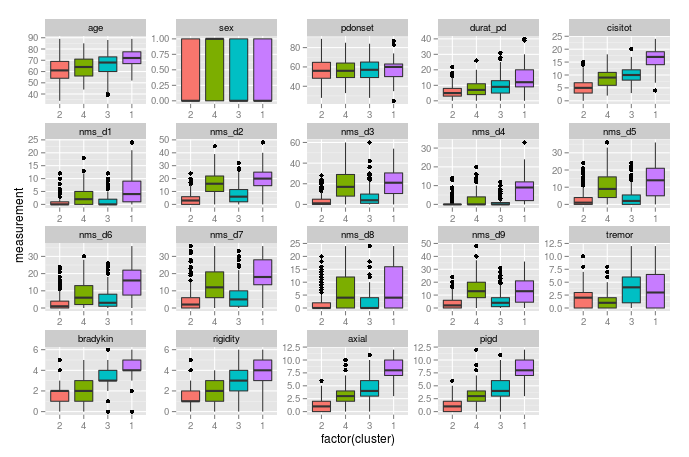

# ca-parkinsons

This repository contains exploratory work done by me at the Polytechnic
University of Madrid in Summer 2015. The objective is to apply cluster analysis
to data collected from Parkinson's disease patients to identify relevant
subtypes and important clinical features. A summary of my results so far is
located in writeup/parkinsons.pdf.

Related work (those that are freely available are also saved in the papers folder):

 - van Rooden et al (2010).
     [The Identification of Parkinson's Disease Subtypes Using Cluster
     Analysis: A Systematic Review](http://www.ncbi.nlm.nih.gov/pubmed/20535823)
 - van Rooden et al (2011). [Clinical Subtypes of Parkinson's
     Disease](http://www.ncbi.nlm.nih.gov/pubmed/21322019)
 - Armañanzas et al (2013). [Unveiling relevant non-motor Parkinson's disease
     severity symptoms using a machine learning
     approach.](http://www.ncbi.nlm.nih.gov/pubmed/23711400)
 - Borchani et al (2012). [Markov blanket-based approach for learning
     multi-dimensional Bayesian network classifiers: An application to predict
     the European Quality of Life-5 Dimensions (EQ-5D) from the 39-item
     Parkinson’s Disease Questionnaire (PDQ-39)
     ](http://www.sciencedirect.com/science/article/pii/S1532046412001074)
 - Fereshtehnejad et al (**June 15, 2015**). [New Clinical Subtypes of
     Parkinson Disease and Their Longitudinal
     Progression](http://archneur.jamanetwork.com/article.aspx?articleid=2318972)
