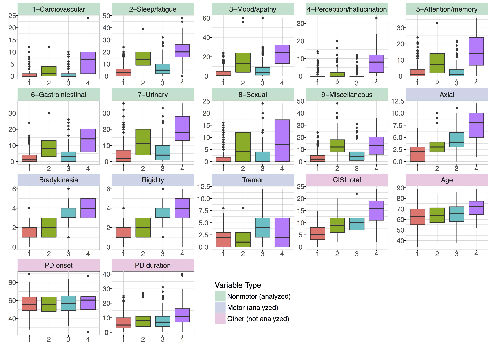
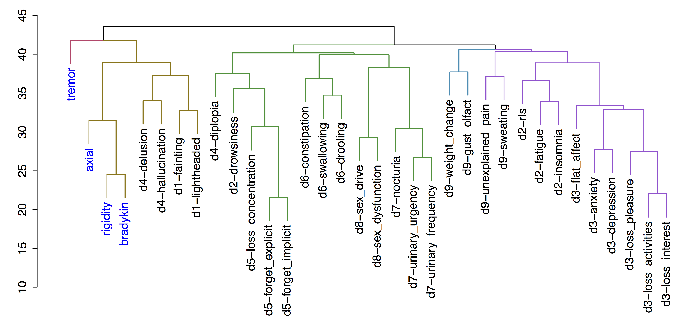
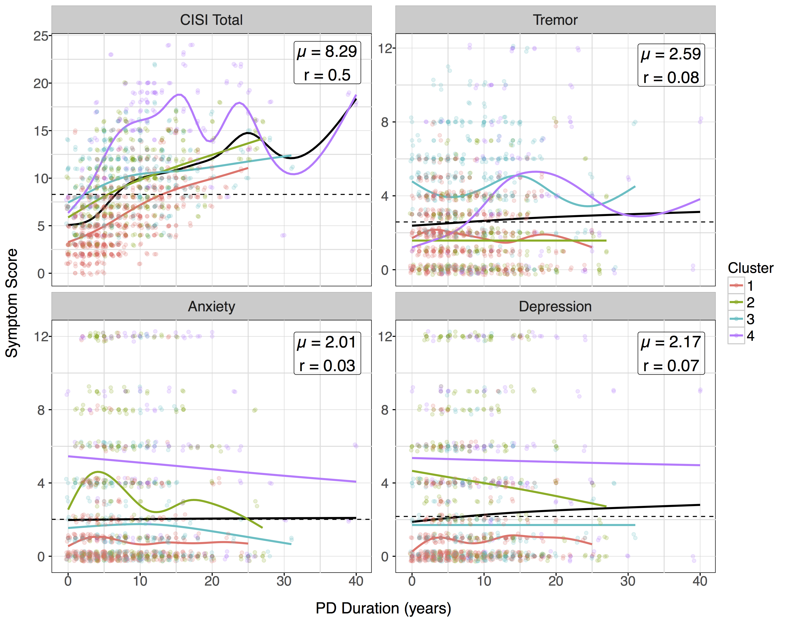

# Parkinson's disease subtypes identified from cluster analysis of motor and non-motor symptoms

This repository contains data, analyses, figures, and writeups for Mu et al.,
Parkinson's disease subtypes identified from cluster analysis of motor and
non-motor symptoms (under review).

The code to reproduce figures is mostly in `publication.R`
which depends first on `source`ing `preprocessing.R` and (maybe??)
`kmeans-dtree.R` and `nms30.R` Additionally, the gap statistic figures

## TODO

- Organize and figure out procedure for exactly reproducing figures. Might be
 able to put everything in preprocessing
- Rename files to something more sensible (kmeans-dtree -> domains, nms30 -> symptoms)
- Continue to get rid of unnecessary figures

